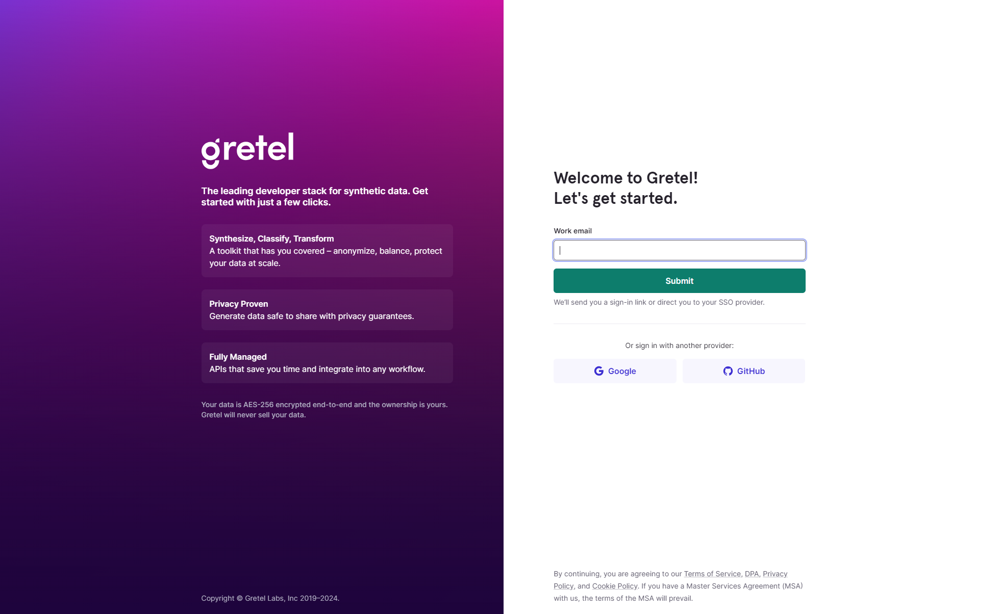
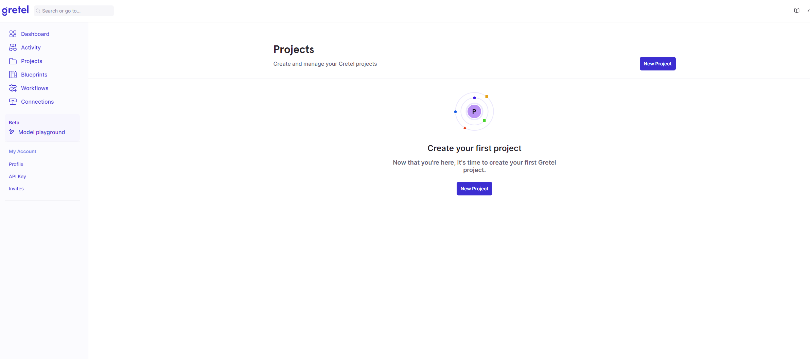

<h2 align="center">
  
</h2>

<h4 align="center">
    Accelerating translation from clinical research to tools
</h4>

## Synthetic Data Generator

This component generates synthetic data using Gretel CLI of Gretel synthetics. For running the component, first install gretel on a cloud server. Follow the below steps to configure gretel:

1. Register on Gretel using this link: https://console.gretel.ai/login/

2. Create a project using the link: https://console.gretel.ai/projects/

Make note of the project name (it will be needed in the configuration of the component)

3. Install Gretel CLI of gretel synthetics on a cloud server using the link: https://docs.gretel.ai/gretel-basics/getting-started/environment-setup/cli-and-sdk

## Component Configuration

To configure the following details to the properties file (application-prod.properties) in resources folder:

1. gretel.server.model.path=~/.gretel/config-xxxx-xxxx.yml (Path of the model configuration provided by Gretel)
2. gretel.project.name=project-name
3. gretel.server.host.name=xxxx.uit.no (Host name of the cloud server where Gretel CLI is installed)
4. gretel.server.user.name=usxx (User name on the cloud server where Gretel CLI is installed)
5. gretel.server.password=passxxx (Password of the cloud server where Gretel CLI is installed)
6. gretel.server.openssh.private.key.path=path/to/openssh/key (Path of the ppen SSH private key the cloud server where Gretel CLI is installed)
7. gretel.server.real.data.input.directory.path=/path/to/real/input/data (Path of the local directory to store the input data on which synthetic data is to be generated)
8. gretel.server.synthetic.data.output.directory.path=/path/to/synthetic/output/data (Path of the local directory to store the synthetic data generated)
9. server.port=XXXX (Port on which the application will run)

### Steps to run the component

1. Using the Dockerfile of the component
   1. Build the image of the dockerfile using the command :
      1. Start the docker daemon
      2. Cd to the root directory of the project (where is the dockerfile)
      3. Build using the command : docker build --tag 'synthetic_fhir_data_services:v1.0' .
         (Argument --tag indicates the repository name for the image (synthetic_fhir_data_services) and tag is v1.0)
   2. Run the docker image using the command : docker run -p 1234:8083 synthetic_fhir_data_services:v1.0
      (synthetic_fhir_data_services is the repository name of the docker image; 8083 is the port number on which the application is running in the container and 1234 is the port number mapped to 8081 port of the container)
2. Pull the docker image from docker hub and run it
   1. Docker image pull command : docker pull pavitra89/synthetic_fhir_data_services:v1.0
   2. Docker image run command : docker run -p 1234:8081 synthetic_fhir_data_services:v1.0

### API details

1. Generate synthetic data

   1. Request URL: http://hostname:port-number/api/v1/synthetic/generate-data?numberOfSynRecords=x00x00
   2. Request Type: POST
   3. Request Body: Will have form-data. With CSV file in request param named "file".
   4. Response Body: CSV file
